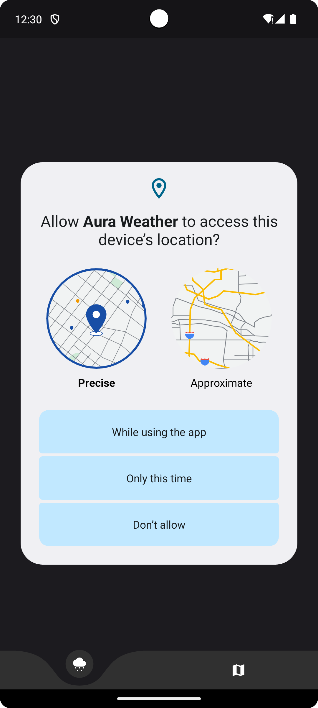
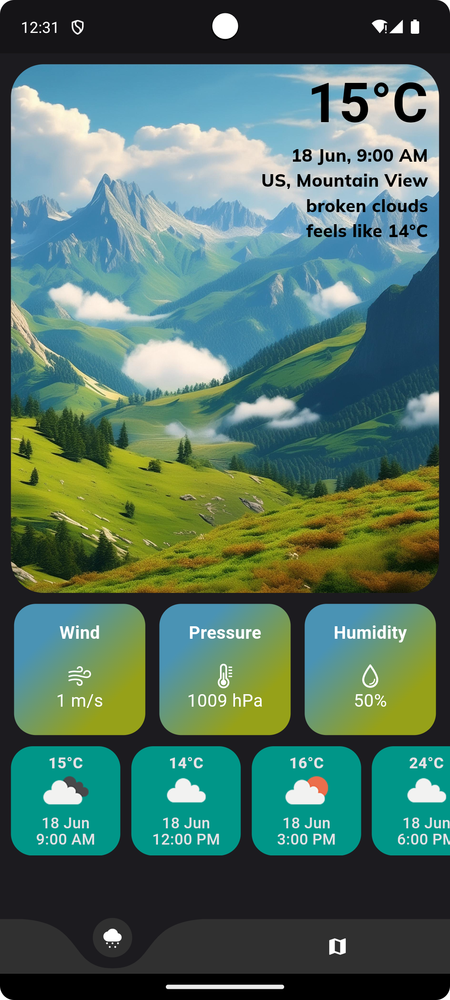
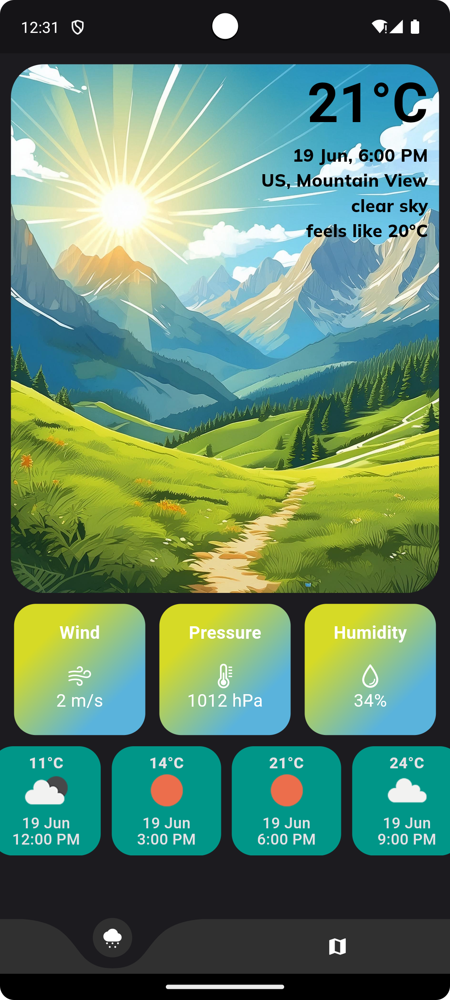
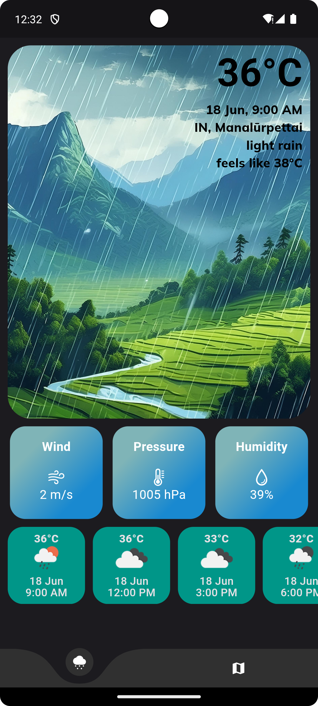
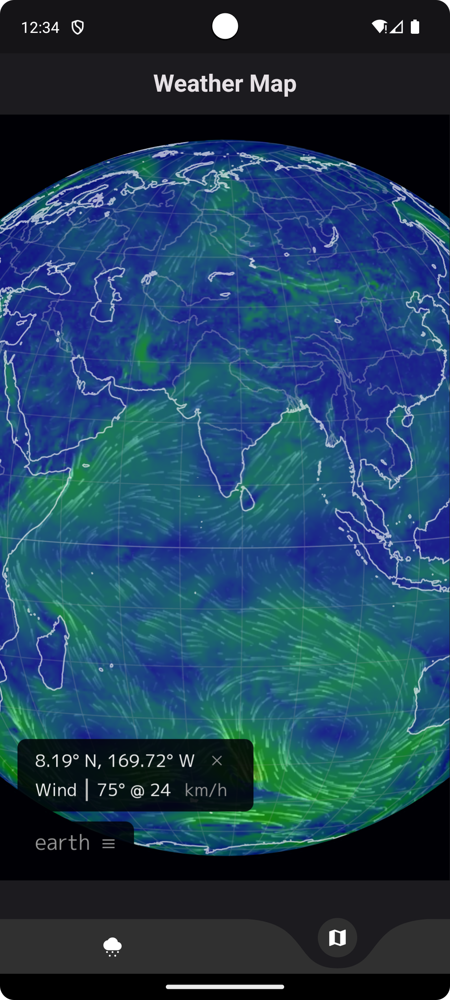
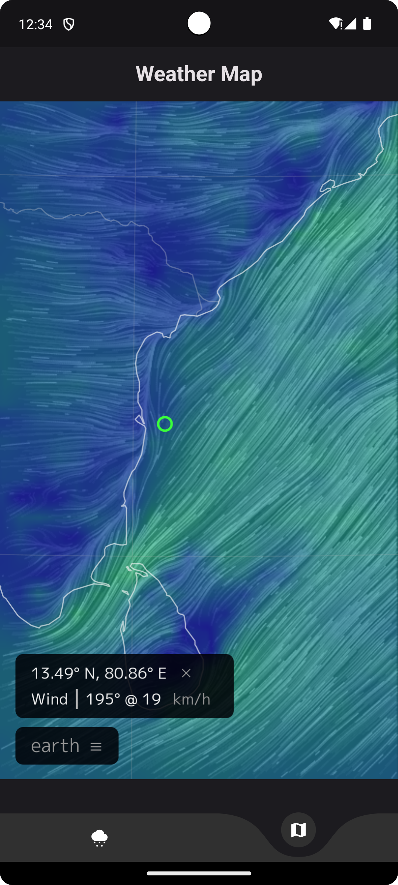

# AuraWeather 

## 🌟 Overview

AuraWeather is a modern and intuitive weather application built using Flutter. It provides accurate weather forecasts using the **OpenWeatherMap API** and features live rendering of a 3D Earth, showcasing global wind, weather, and ocean conditions using a **WebView** widget. Currently, AuraWeather is available exclusively for Android devices.

## 🔥 Features

- 🌤️ **5 Day / 3 Hour Weather Forecast**: Get detailed weather forecasts every 3 hours for the next 5 days.
- 🌍 **Live 3D Earth Visualization**: View real-time global weather patterns, wind, and ocean conditions.
- 💎 **Interactive UI**: Smooth and responsive user interface built with Flutter.
- 📊 **Accurate Data**: Powered by the OpenWeatherMap API for reliable weather data.

## 📸 Screenshots

        
        
        
        
        
        

## 📥 Installation
To use AuraWeather on your Android device, download the latest APK from the link below:

## 🌐 APIs Used

- **OpenWeatherMap API** : Utilized for fetching 5 Day / 3 Hour weather forecasts.
- **WebView Widget**: For rendering a global map of wind, weather, and ocean conditions.
- **Geolocator Package**: Used for retrieving the user's current location to provide localized weather information.

